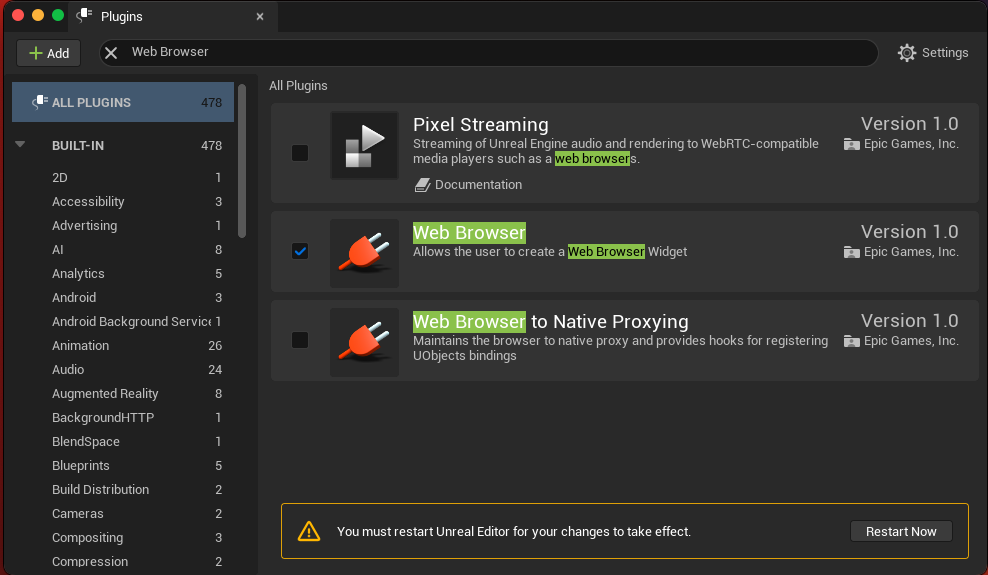
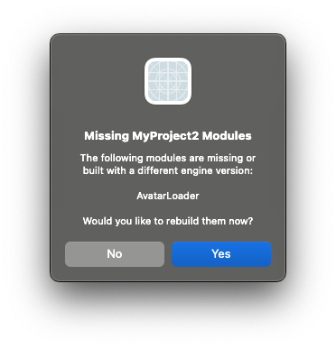
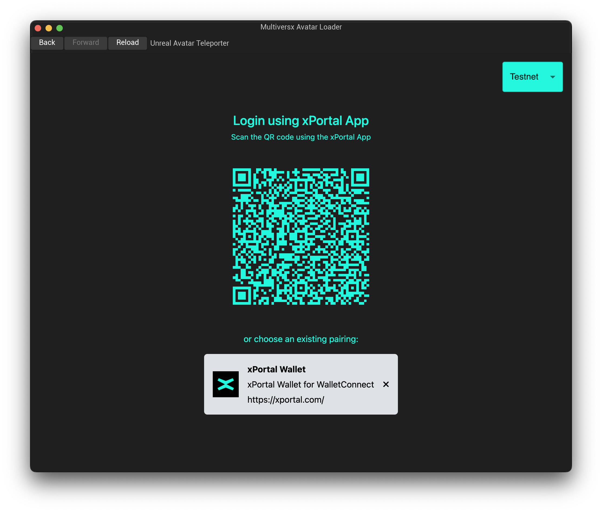
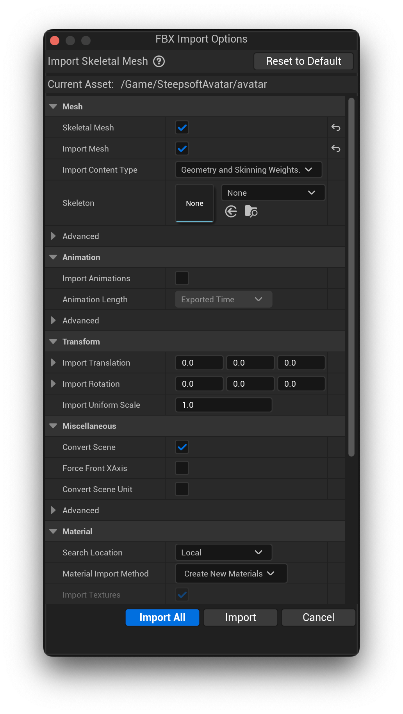

# Multiversx Avatar Loader

## Description

An easy-to-use plugin, which will help you import your Multiversx Avatar from xPortal to your Unreal Engine project.

## Dependencies

- **Web Browser**: This plugin requires the 'Web Browser' plugin to be enabled in Unreal Engine. To enable it, go to 'Edit' > 'Plugins' in your Unreal Engine editor, find the 'Web Browser' plugin in the list, select it, and click "Restart Now".

## Plugin Installation

1. Navigate to the root of your Unreal Engine project.
2. If you don't have a folder named 'Plugins', create one in the project's root directory.
3. Inside the 'Plugins' folder, clone the repository and rename it to 'AvatarLoader'.
4. Restart your Unreal Engine project for the changes to take effect.
5. You should receive the Missing Modules popup. Click Yes, and wait for the Editor to open with your project.

## How to use

1. After the plugin installation is complete, a 'Multiversx' button will appear in the Unreal Engine editor toolbar.

2. Click the button to open the plugin. In the upper right corner, you'll find the Multiversx environment dropdown to choose one of the 3 environments.
3. For the login process, scan the QR code using your xPortal app.

4. A new window will open, where you can select the import options for your avatar.

5. Your avatar is ready to use!

Notes:

- For updates to take effect, please follow the steps in the Unreal Engine [official documentation](https://dev.epicgames.com/community/learning/tutorials/qz93/unreal-engine-building-plugins).
